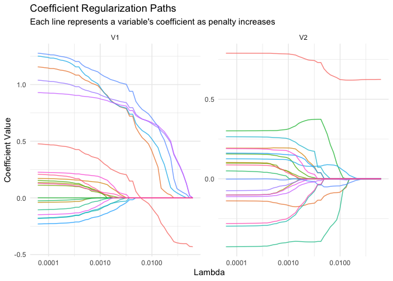
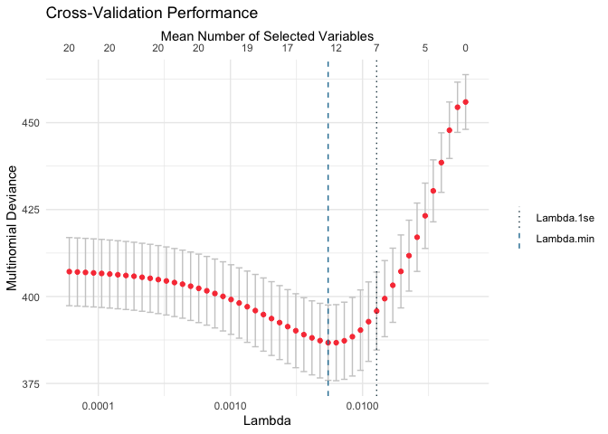

<!-- README.md is generated from README.Rmd. Please edit that file -->

# cbSCRIP: Case-Base Sampling for Sparse Competing Risk Prediction

<!-- badges: start -->

<!-- badges: end -->

## Overview

`cbSCRIP` implements an estimator based on **case-base sampling** for
sparse competing risk prediction. It uses an elastic-net penalized
multinomial approach with an offset parameter, enabling both accurate
prediction and variable selection under competing risks. This approach
allows for efficient estimation of cause-specific hazards in
high-dimensional settings.

## Installation

You can install the development version of `cbSCRIP` from
[GitHub](https://github.com/JavierMtzRdz/cbSCRIP):

``` r
# Install remotes if needed
# install.packages("remotes")
remotes::install_github("JavierMtzRdz/cbSCRIP")
```

## Quick Start

``` r
library(cbSCRIP)
library(survival)

# Generate synthetic competing risks data
set.seed(123)
n <- 200
p <- 20
num_true <- 5
data_list <- cbSCRIP::gen_data(n_train = n, p = p, num_true = num_true, setting = 1)
#> ℹ Setting: 1 | Iteration 258819.768112153/ | seed = 45461 | p = 20 | k = 5
train <- data_list$train

# Fit a penalized case-base model
fit <- cbSCRIP(
  Surv(ftime, fstatus) ~ .,
  data = train,
  nlambda = 50,
  fit_fun = MNlogisticCCD,
  ratio = 20,
  coeffs = "original" 
)
#> ℹ Creating case-base dataset...
#> ℹ Created base series with 3000 samples based on 150 event(s).
#> ✔ Calculated lambda_max: 0.0618
#> ℹ Using 50 lambdas. Range: 0.0000618 to 0.0618
#> ℹ Fitting model path for 50 lambda values...
#> ✔ Path fitting complete.

# Summary 
fit
#> --- Case-Base Competing Risks Model Path ---
#> 
#> Call:
#> cbSCRIP(formula = Surv(ftime, fstatus) ~ ., data = train, nlambda = 50, 
#>     ratio = 20, coeffs = "original", fit_fun = MNlogisticCCD)
#> 
#> Regularization path fit for 50 lambda values.
#> Number of non-zero coefficients: from 0 to 20.

# Plot
plot(fit)
```



``` r

# Perform cross-validation to select the optimal lambda
cv_fit <- cv_cbSCRIP(
  Surv(ftime, fstatus) ~ .,
  data = train,
  nfold = 3,
  nlambda = 50,
  ratio = 20
)
#> ℹ Created base series with 3000 samples based on 150 event(s).
#> ✔ Calculated lambda_max: 0.0603
#> ℹ Using 50 lambdas. Range: 0.0000603 to 0.0603
#> ℹ Starting 3-fold cross-validation...
#> Warning: package ‘future’ was built under R version 4.5.2
#> Warning: package ‘purrr’ was built under R version 4.5.2
#> Warning: package ‘future’ was built under R version 4.5.2
#> Warning: package ‘purrr’ was built under R version 4.5.2
#> Warning: package ‘future’ was built under R version 4.5.2
#> Warning: package ‘purrr’ was built under R version 4.5.2
#> ✔ Cross-validation complete.

# Summary 
cv_fit
#> --- Cross-Validated Case-Base Competing Risks Model ---
#> 
#> Call:
#> cv_cbSCRIP(formula = Surv(ftime, fstatus) ~ ., data = train, 
#>     nfold = 3, nlambda = 50, ratio = 20)
#> 
#> Performed 3-fold cross-validation over 50 lambda values.
#> 
#> Optimal Lambda Values:
#>   Lambda with minimum deviance (lambda.min): 0.0055
#>   Largest lambda within 1 SE of min (lambda.1se): 0.0128
#> 
#> The final model (fit.min) was fit using lambda.min and has 14 non-zero coefficients.

# Plot
plot(cv_fit)
```



## Features

- Efficiently handles large-scale survival and competing risks data by
  transforming it into a multinomial framework.
- Supports **Lasso** and **Elastic-Net** penalties for variable
  selection in high-dimensional datasets ($p > n$).
- **Optimizers**:
  - `MNlogisticCCD`: Cyclical Coordinate Descent (efficient for sparse
    paths).
  - `MNlogisticSAGAN`: Stochastic Average Gradient (SAGA) with Nesterov
    acceleration.
  - `MNlogisticSVRG`: Stochastic Variance Reduced Gradient.

## License

MIT + file LICENSE
