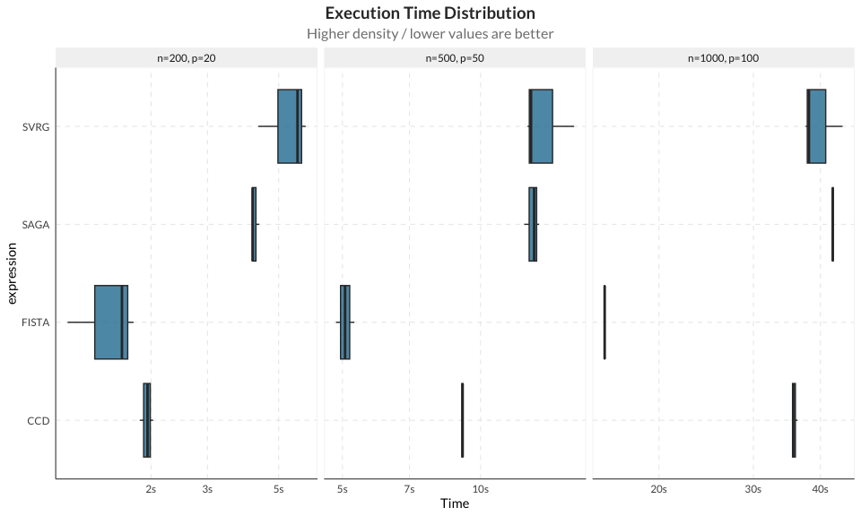
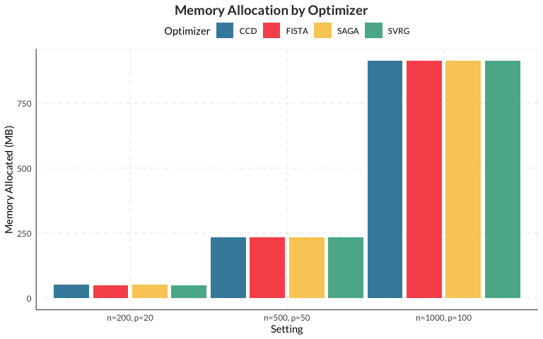
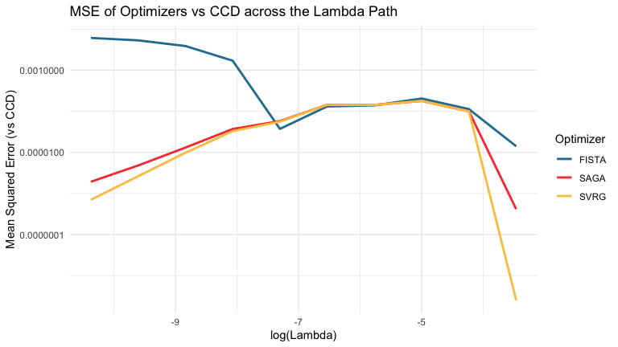

# Optimizer Benchmark


``` r
devtools::load_all(".")

pacman::p_load(survival, bench, ggplot2, dplyr, tidyr)
```

## Overview

This benchmark compares the three optimization algorithms available in
`cbSCRIP`:

- **CCD**: Cyclical Coordinate Descent
- **SAGA**: Stochastic Average Gradient with Nesterov acceleration
- **SVRG**: Stochastic Variance Reduced Gradient

We evaluate performance across different dataset sizes measuring:

- **Execution time**
- **Memory allocation**

## Data Generation

``` r
set.seed(42)

# Define benchmark configurations
configs <- tibble::tibble(
  n = c(200, 500, 1000),
  p = c(20, 50, 100),
  config_name = paste0("n=", n, ", p=", p)
)

# Generate datasets
datasets <- purrr::map2(configs$n, configs$p, function(n, p) {
  gen_data(n_train = n, p = p, num_true = 5, setting = 1)
})
names(datasets) <- configs$config_name
```

## Benchmark Function

``` r
run_optimizer_benchmark <- function(train_data, optimizer, nlambda = 10) {
  set.seed(42)
  cbSCRIP(
    Surv(ftime, fstatus) ~ .,
    data = train_data,
    nlambda = nlambda,
    optimizer = optimizer,
    ratio = 50,
    coeffs = "original"
  )
}
```

## Running Benchmarks

``` r
optimizers <- c("CCD", "SAGA", "SVRG", "FISTA")

# Run benchmarks using bench::press to standardise output
benchmark_results <- bench::press(
  config_name = configs$config_name,
  {
    data <- datasets[[config_name]]$train
    bench::mark(
      CCD = run_optimizer_benchmark(data, "CCD"),
      SAGA = run_optimizer_benchmark(data, "SAGA"),
      SVRG = run_optimizer_benchmark(data, "SVRG"),
      FISTA = run_optimizer_benchmark(data, "FISTA"),
      iterations = 3,
      check = FALSE,
      memory = TRUE
    )
  }
)

# Ensure proper ordering of configurations
benchmark_results <- benchmark_results |>
  mutate(config_name = factor(config_name, levels = configs$config_name))

benchmark_results
```

    #> # A tibble: 12 × 7
    #>    expression config_name        min   median `itr/sec` mem_alloc `gc/sec`
    #>    <bch:expr> <fct>         <bch:tm> <bch:tm>     <dbl> <bch:byt>    <dbl>
    #>  1 CCD        n=200, p=20      1.84s    1.95s    0.515       49MB    1.20 
    #>  2 SAGA       n=200, p=20      4.13s    4.15s    0.237       48MB    0.554
    #>  3 SVRG       n=200, p=20      4.32s    5.72s    0.186       47MB    0.248
    #>  4 FISTA      n=200, p=20       1.1s    1.62s    0.669     46.3MB    0.669
    #>  5 CCD        n=500, p=50      9.07s    9.14s    0.110    223.1MB    0.511
    #>  6 SAGA       n=500, p=50     12.45s   13.09s    0.0770   223.3MB    0.359
    #>  7 SVRG       n=500, p=50     12.66s   12.88s    0.0722   223.2MB    0.337
    #>  8 FISTA      n=500, p=50      4.84s    5.07s    0.197    222.9MB    0.723
    #>  9 CCD        n=1000, p=100   35.39s    35.6s    0.0280     871MB    0.270
    #> 10 SAGA       n=1000, p=100   42.11s   42.19s    0.0237   871.3MB    0.174
    #> 11 SVRG       n=1000, p=100   37.55s   38.08s    0.0251   871.3MB    0.184
    #> 12 FISTA      n=1000, p=100   15.83s   15.84s    0.0631   870.7MB    0.526

## Results

### Execution Time

``` r
autoplot(benchmark_results, type = "boxplot") +
  facet_wrap(~config_name, scales = "free_x") +
  labs(
    title = "Execution Time Distribution",
    subtitle = "Higher density / lower values are better",
    x = "Time"
  ) +
  theme(legend.position = "none")
```



### Memory Allocation

``` r
benchmark_results |>
  mutate(
    mem_mb = as.numeric(mem_alloc) / 1e6
  ) |>
  ggplot(aes(x = config_name, y = mem_mb, fill = as.character(expression))) +
  geom_col(position = position_dodge(width = 1)) +
  labs(
    title = "Memory Allocation by Optimizer",
    x = "Setting",
    y = "Memory Allocated (MB)",
    fill = "Optimizer"
  )
```



### Summary Table

``` r
benchmark_results |>
  mutate(
    time_sec = round(as.numeric(median), 3),
    mem_mb = round(as.numeric(mem_alloc) / 1e6, 2)
  ) |>
  select(Setting = config_name, Optimizer = expression, 
         `Time (s)` = time_sec, `Memory (MB)` = mem_mb) |>
  knitr::kable()
```

| Setting       | Optimizer | Time (s) | Memory (MB) |
|:--------------|:----------|---------:|------------:|
| n=200, p=20   | CCD       |    1.951 |       51.42 |
| n=200, p=20   | SAGA      |    4.148 |       50.35 |
| n=200, p=20   | SVRG      |    5.725 |       49.33 |
| n=200, p=20   | FISTA     |    1.624 |       48.59 |
| n=500, p=50   | CCD       |    9.140 |      233.96 |
| n=500, p=50   | SAGA      |   13.087 |      234.13 |
| n=500, p=50   | SVRG      |   12.885 |      234.04 |
| n=500, p=50   | FISTA     |    5.067 |      233.78 |
| n=1000, p=100 | CCD       |   35.599 |      913.31 |
| n=1000, p=100 | SAGA      |   42.188 |      913.66 |
| n=1000, p=100 | SVRG      |   38.078 |      913.66 |
| n=1000, p=100 | FISTA     |   15.841 |      913.05 |

### Accuracy and Parameter Value Reaching Validation

To ensure all four optimizers converge to the expected parameter values
and match each other, we extract the estimated coefficient matrices
across the entire lambda path on the single dataset configuration
($n=500, p=50$) and compute the pairwise Pearson correlation matrix.

We also compute the Mean Squared Error (MSE) of the estimated
cause-specific coefficients relative to the true baseline coefficients
(`beta1`), as well as the MSE between the optimizers across all lambdas
to verify that their estimation paths are identical.

``` r
data_val <- datasets[["n=500, p=50"]]
train_val <- data_val$train
true_beta1 <- data_val$beta1

fit_ccd <- run_optimizer_benchmark(train_val, "CCD")
fit_saga <- run_optimizer_benchmark(train_val, "SAGA")
fit_svrg <- run_optimizer_benchmark(train_val, "SVRG")
fit_fista <- run_optimizer_benchmark(train_val, "FISTA")

# Extract coefficients for all lambda matrices and flatten to numeric vector
coef_ccd <- unlist(fit_ccd$coefficients)
coef_saga <- unlist(fit_saga$coefficients)
coef_svrg <- unlist(fit_svrg$coefficients)
coef_fista <- unlist(fit_fista$coefficients)

# Combine into matrix for correlation
all_coefs <- cbind(
  CCD = coef_ccd,
  SAGA = coef_saga,
  SVRG = coef_svrg,
  FISTA = coef_fista
)

# Compute correlation matrix
cor_matrix <- cor(all_coefs)

# Extract cause 1 coefficients (excluding the log-time and intercept rows at the end)
p_val <- length(true_beta1)
coef_ccd_c1 <- fit_ccd$coefficients[[5]][1:p_val, 1]
coef_saga_c1 <- fit_saga$coefficients[[5]][1:p_val, 1]
coef_svrg_c1 <- fit_svrg$coefficients[[5]][1:p_val, 1]
coef_fista_c1 <- fit_fista$coefficients[[5]][1:p_val, 1]

# Compute Bias MSE helper function
mse_bias <- function(coef, true_coef) {
  mean((coef - true_coef)^2)
}

mse_table <- tibble::tibble(
  Optimizer = c("CCD", "SAGA", "SVRG", "FISTA"),
  `Bias MSE` = c(
    mse_bias(coef_ccd_c1, true_beta1),
    mse_bias(coef_saga_c1, true_beta1),
    mse_bias(coef_svrg_c1, true_beta1),
    mse_bias(coef_fista_c1, true_beta1)
  )
)

knitr::kable(cor_matrix, caption = "Pairwise Pearson Correlation of Estimated Coefficients (n=500, p=50, all Lambdas)")
```

|       |       CCD |      SAGA |      SVRG |     FISTA |
|:------|----------:|----------:|----------:|----------:|
| CCD   | 1.0000000 | 0.9994858 | 0.9994808 | 0.9874538 |
| SAGA  | 0.9994858 | 1.0000000 | 0.9999992 | 0.9872974 |
| SVRG  | 0.9994808 | 0.9999992 | 1.0000000 | 0.9872398 |
| FISTA | 0.9874538 | 0.9872974 | 0.9872398 | 1.0000000 |

Pairwise Pearson Correlation of Estimated Coefficients (n=500, p=50, all
Lambdas)

``` r
knitr::kable(mse_table, caption = "Bias Mean Squared Error (MSE) of Estimated Cause 1 Coefficients (relative to True beta1)")
```

| Optimizer |  Bias MSE |
|:----------|----------:|
| CCD       | 0.0021566 |
| SAGA      | 0.0033972 |
| SVRG      | 0.0033908 |
| FISTA     | 0.0033627 |

Bias Mean Squared Error (MSE) of Estimated Cause 1 Coefficients
(relative to True beta1)

``` r
# Direct Comparison of Estimated Coefficients
coef_compare_df <- tibble::tibble(
  Variable = paste0("X", 1:p_val),
  True = true_beta1,
  CCD = coef_ccd_c1,
  SAGA = coef_saga_c1,
  SVRG = coef_svrg_c1,
  FISTA = coef_fista_c1
)

knitr::kable(head(coef_compare_df, 15), caption = "Comparison of Estimated Coefficients for Cause 1 (First 15 variables, 5th Lambda)")
```

| Variable | True |       CCD |      SAGA |      SVRG |     FISTA |
|:---------|-----:|----------:|----------:|----------:|----------:|
| X1       |    1 | 0.8129618 | 0.7595971 | 0.7597742 | 0.7612527 |
| X2       |    1 | 0.8179921 | 0.7683918 | 0.7685559 | 0.7695334 |
| X3       |    1 | 0.8952497 | 0.8492418 | 0.8494249 | 0.8496778 |
| X4       |    1 | 0.9706951 | 0.9288270 | 0.9291317 | 0.9292240 |
| X5       |    1 | 0.8581291 | 0.8409422 | 0.8411442 | 0.8421594 |
| X6       |    0 | 0.0000000 | 0.0000000 | 0.0000000 | 0.0000000 |
| X7       |    0 | 0.0000000 | 0.0000000 | 0.0000000 | 0.0000000 |
| X8       |    0 | 0.0000000 | 0.0000000 | 0.0000000 | 0.0000000 |
| X9       |    0 | 0.0000000 | 0.0000000 | 0.0000000 | 0.0000000 |
| X10      |    0 | 0.0000000 | 0.0000000 | 0.0000000 | 0.0000000 |
| X11      |    0 | 0.0000000 | 0.0000000 | 0.0000000 | 0.0000000 |
| X12      |    0 | 0.0000000 | 0.0000000 | 0.0000000 | 0.0000000 |
| X13      |    0 | 0.0028312 | 0.0001230 | 0.0001301 | 0.0006167 |
| X14      |    0 | 0.0000000 | 0.0000000 | 0.0000000 | 0.0000000 |
| X15      |    0 | 0.0000000 | 0.0000000 | 0.0000000 | 0.0000000 |

Comparison of Estimated Coefficients for Cause 1 (First 15 variables,
5th Lambda)

``` r
# Compute MSE between optimizers across ALL lambdas
mse_path <- lapply(1:length(fit_ccd$lambdagrid), function(l) {
  # Flatten coefficients for this specific lambda
  c_ccd <- as.vector(fit_ccd$coefficients[[l]])
  c_saga <- as.vector(fit_saga$coefficients[[l]])
  c_svrg <- as.vector(fit_svrg$coefficients[[l]])
  c_fista <- as.vector(fit_fista$coefficients[[l]])
  
  tibble::tibble(
    Lambda = fit_ccd$lambdagrid[l],
    LambdaIndex = l,
    SAGA = mse_bias(c_saga, c_ccd),
    SVRG = mse_bias(c_svrg, c_ccd),
    FISTA = mse_bias(c_fista, c_ccd)
  )
}) |> dplyr::bind_rows()

# Reshape and plot
mse_path_long <- tidyr::pivot_longer(mse_path, cols = c("SAGA", "SVRG", "FISTA"), 
                                     names_to = "Optimizer", values_to = "MSE_vs_CCD")

ggplot(mse_path_long, aes(x = log(Lambda), y = MSE_vs_CCD, color = Optimizer)) +
  geom_line(linewidth = 1) +
  theme_minimal() +
  labs(
    title = "MSE of Optimizers vs CCD across the Lambda Path",
    x = "log(Lambda)",
    y = "Mean Squared Error (vs CCD)"
  ) +
  scale_y_log10()
```



## Unpenalized cbSCRIP vs VGAM Validation

To ensure that the optimizers are working correctly without
regularization, we compare `cbSCRIP` with a very small penalty
(`lambda = 1e-10`) against `VGAM::vglm`. Because `VGAM` is
computationally constrained and typically fails when covariates exceed
30-40, we generate a smaller dataset ($p=20$) for this corroboration.

``` r
# Generate a smaller dataset for VGAM
set.seed(123)
data_list_small <- gen_data(n_train = 500, p = 20, num_true = 5, setting = 1)
train_small <- data_list_small$train

# 1. Fit VGAM
cb_data_small <- create_cb_data(Surv(ftime, fstatus) ~ ., data = train_small, ratio = 10)
# Flatten cb_data for VGAM
vgam_df <- data.frame(
  event = as.factor(cb_data_small$event),
  time = cb_data_small$time,
  offset = cb_data_small$offset
)
vgam_df <- cbind(vgam_df, cb_data_small$covariates)

vglm_fit <- VGAM::vglm(event ~ . - time + log(time) - offset, 
                 family = VGAM::multinomial(refLevel = 1), 
                 data = vgam_df, 
                 offset = offset,
                 maxit = 100)

# Extract and format VGAM coefficients to match cbSCRIP
vglm_coefs <- VGAM::coef(vglm_fit, matrix = TRUE)
# Reorder to match cbSCRIP: covariates, log(time), intercept
vglm_covs <- vglm_coefs[!rownames(vglm_coefs) %in% c("(Intercept)", "log(time)"), ]
vglm_time <- vglm_coefs["log(time)", , drop = FALSE]
vglm_int <- vglm_coefs["(Intercept)", , drop = FALSE]
vglm_formatted <- rbind(vglm_covs, vglm_time, vglm_int)
colnames(vglm_formatted) <- 1:ncol(vglm_formatted)

# 2. Fit cbSCRIP for all optimizers (unpenalized approximation)
optimizers <- c("CCD", "SAGA", "SVRG", "FISTA")
cb_fits <- lapply(optimizers, function(opt) {
  cbSCRIP(Surv(ftime, fstatus) ~ ., 
          cb_data = cb_data_small, 
          regularization = "elastic-net",
          lambda = 1e-10, 
          optimizer = opt,
          coeffs = "original")
})

# 3. Compare coefficients
vglm_flat <- as.vector(vglm_formatted)

validation_results <- do.call(rbind, lapply(1:length(optimizers), function(i) {
  cb_flat <- as.vector(cb_fits[[i]]$coefficients)
  tibble::tibble(
    Model = paste0("cbSCRIP ", optimizers[i], " (lambda=1e-10)"),
    Reference = "VGAM::vglm",
    `MSE between estimates` = mean((vglm_flat - cb_flat)^2),
    `Max Absolute Diff` = max(abs(vglm_flat - cb_flat))
  )
}))

validation_results |> knitr::kable(caption = "Validation of Unpenalized cbSCRIP (All Optimizers) against VGAM")
```

| Model | Reference | MSE between estimates | Max Absolute Diff |
|:---|:---|---:|---:|
| cbSCRIP CCD (lambda=1e-10) | VGAM::vglm | 0.0000113 | 0.0074420 |
| cbSCRIP SAGA (lambda=1e-10) | VGAM::vglm | 0.0000178 | 0.0107058 |
| cbSCRIP SVRG (lambda=1e-10) | VGAM::vglm | 0.0000172 | 0.0104265 |
| cbSCRIP FISTA (lambda=1e-10) | VGAM::vglm | 0.0000414 | 0.0182288 |

Validation of Unpenalized cbSCRIP (All Optimizers) against VGAM

## Session Info

``` r
sessionInfo()
```

    #> R version 4.5.1 (2025-06-13)
    #> Platform: aarch64-apple-darwin20
    #> Running under: macOS Tahoe 26.5.2
    #> 
    #> Matrix products: default
    #> BLAS:   /Library/Frameworks/R.framework/Versions/4.5-arm64/Resources/lib/libRblas.0.dylib 
    #> LAPACK: /Library/Frameworks/R.framework/Versions/4.5-arm64/Resources/lib/libRlapack.dylib;  LAPACK version 3.12.1
    #> 
    #> locale:
    #> [1] en_US.UTF-8/en_US.UTF-8/en_US.UTF-8/C/en_US.UTF-8/C.UTF-8
    #> 
    #> time zone: America/Mexico_City
    #> tzcode source: internal
    #> 
    #> attached base packages:
    #> [1] stats     graphics  grDevices utils     datasets  methods   base     
    #> 
    #> other attached packages:
    #>  [1] tidyr_1.3.2         dplyr_1.2.1         bench_1.1.4        
    #>  [4] survival_3.8-9      cbSCRIP_0.1.1       testthat_3.3.2     
    #>  [7] mytidyfunctions_0.1 ggplot2_4.0.3       devtools_2.5.2     
    #> [10] usethis_3.2.1       pacman_0.5.1       
    #> 
    #> loaded via a namespace (and not attached):
    #>   [1] pROC_1.19.0.1             gridExtra_2.3            
    #>   [3] sandwich_3.1-1            rlang_1.3.0              
    #>   [5] magrittr_2.0.5            multcomp_1.4-29          
    #>   [7] furrr_0.3.1               otel_0.2.0               
    #>   [9] polspline_1.1.25          compiler_4.5.1           
    #>  [11] mgcv_1.9-4                vctrs_0.7.3              
    #>  [13] reshape2_1.4.5            quantreg_6.1             
    #>  [15] stringr_1.6.0             pkgconfig_2.0.3          
    #>  [17] shape_1.4.6.1             crayon_1.5.3             
    #>  [19] fastmap_1.2.0             backports_1.5.1          
    #>  [21] ellipsis_0.3.3            labeling_0.4.3           
    #>  [23] rmarkdown_2.31            prodlim_2026.03.11       
    #>  [25] sessioninfo_1.2.3         riskRegression_2025.09.17
    #>  [27] MatrixModels_0.5-4        purrr_1.2.2              
    #>  [29] xfun_0.60                 glmnet_4.1-10            
    #>  [31] cachem_1.1.0              jsonlite_2.0.0           
    #>  [33] recipes_1.3.3             VGAM_1.1-14              
    #>  [35] timereg_2.0.7             cluster_2.1.8.1          
    #>  [37] parallel_4.5.1            R6_2.6.1                 
    #>  [39] stringi_1.8.7             RColorBrewer_1.1-3       
    #>  [41] parallelly_1.48.0         pkgload_1.5.2            
    #>  [43] rpart_4.1.27              brio_1.1.5               
    #>  [45] lubridate_1.9.5           numDeriv_2016.8-1.1      
    #>  [47] Rcpp_1.1.2                iterators_1.0.14         
    #>  [49] knitr_1.51                future.apply_1.20.2      
    #>  [51] zoo_1.8-15                base64enc_0.1-6          
    #>  [53] Matrix_1.7-5              splines_4.5.1            
    #>  [55] nnet_7.3-20               timechange_0.4.0         
    #>  [57] tidyselect_1.2.1          rstudioapi_0.18.0        
    #>  [59] yaml_2.3.12               timeDate_4052.112        
    #>  [61] codetools_0.2-20          listenv_1.0.0            
    #>  [63] pkgbuild_1.4.8            lattice_0.22-9           
    #>  [65] tibble_3.3.1              plyr_1.8.9               
    #>  [67] withr_3.0.3               S7_0.2.2                 
    #>  [69] evaluate_1.0.5            foreign_0.8-90           
    #>  [71] casebase_0.10.6           future_1.75.0            
    #>  [73] desc_1.4.3                pillar_1.11.1            
    #>  [75] checkmate_2.3.4           foreach_1.5.2            
    #>  [77] stats4_4.5.1              generics_0.1.4           
    #>  [79] rprojroot_2.1.1           scales_1.4.0             
    #>  [81] RcppArmadillo_15.2.3-1    globals_0.19.1           
    #>  [83] class_7.3-23              glue_1.8.1               
    #>  [85] Hmisc_5.2-5               rms_8.1-0                
    #>  [87] tools_4.5.1               data.table_1.18.4        
    #>  [89] SparseM_1.84-2            ModelMetrics_1.2.2.2     
    #>  [91] gower_1.0.2               fs_2.1.0                 
    #>  [93] mvtnorm_1.3-3             grid_4.5.1               
    #>  [95] pec_2025.06.24            colorspace_2.1-2         
    #>  [97] ipred_0.9-15              nlme_3.1-168             
    #>  [99] htmlTable_2.4.3           Formula_1.2-5            
    #> [101] cli_3.6.6                 lava_1.9.2               
    #> [103] mets_1.3.9                gtable_0.3.6             
    #> [105] digest_0.6.39             progressr_1.0.0          
    #> [107] caret_7.0-1               TH.data_1.1-5            
    #> [109] htmlwidgets_1.6.4         farver_2.1.2             
    #> [111] memoise_2.0.1             htmltools_0.5.9          
    #> [113] cmprsk_2.2-12             lifecycle_1.0.5          
    #> [115] hardhat_1.4.3             MASS_7.3-66
